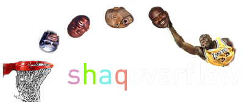
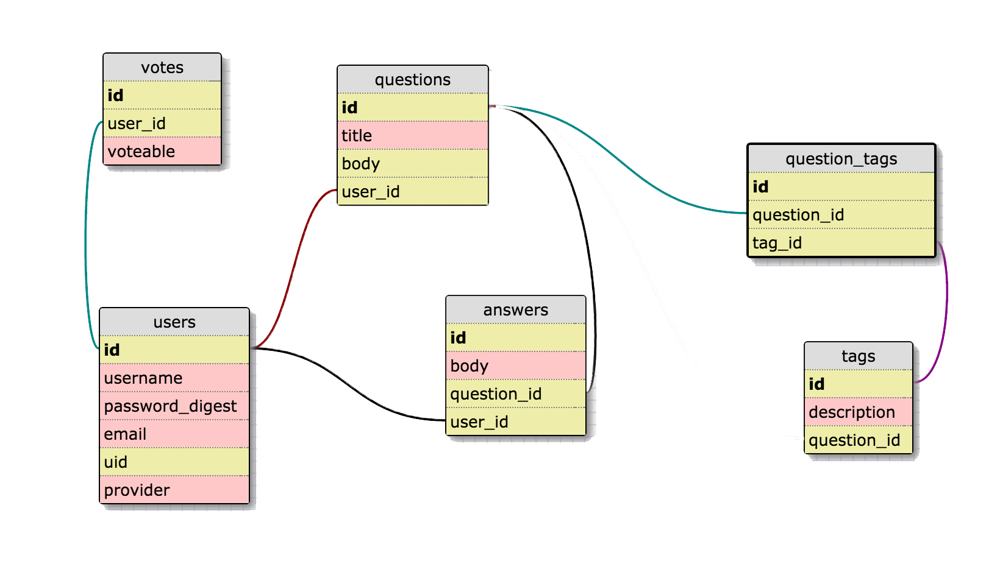

## ShaqOverflow

***

###Introduction

Welcome to our team! The members are Ersan U, Jake R, David T, and Jason W! We are delighted to introduce you to our attempt to replicate the popular website, StackOverflow. This was a 4 day project.

***

###MVP Goals

All Users should be able to read a question.

All Users should be able to register or login an account

Registered Users should be able to post a question or answer a question.

***

###How We Did It

Note: This was an initial schema before we performed a stretch goal and added comments. The following is true.

1. Comments belong to user and answer
2. Comments has a body attribute

[Trello Account](https://trello.com/b/mQaVrrDy)

As a team, we chose to pick up the tasks to start constructing the project. If any of us ran into difficulty, we usually paired up or collaborated as a group to figure out the best way to tackle the situation. As you can see above, we talked out user stories, schemas, and wireframes before working together on the migrations and models together.

***

###Technologies Used

Ruby on Rails, Javascript, HTML5. Under javascript, we used jquery to make ajax-based forms which would allow the user to seamlessly add answers or comments. In addition, we experimented with HTML5 presentation to create a more dynamic presentation.

***

###Our Experience

This was an excellent experience because we got to implement everything a fully fledged application would have. We built a fully functional rails application with heavy javascript front end.
